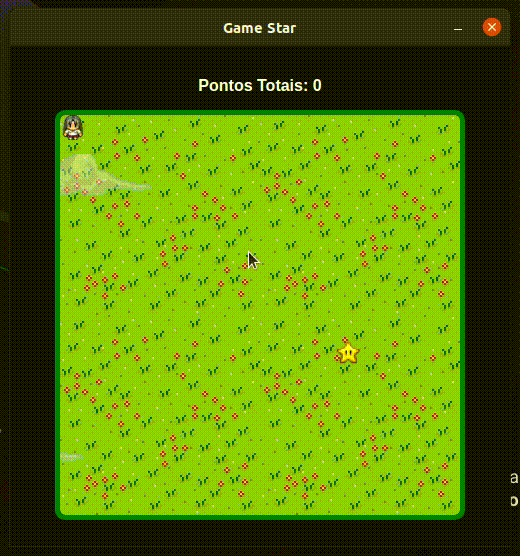

<h1 align="center">
    
</h1>

---

<h2 align="center">:star: Game Star :star:</h2>

Esse é um simples jogo usando **HTML**, **CSS** e **JavaScript**, sendo iniciados usando o [ElectronJS](https://www.electronjs.org/). Onde o objetivo é pegar estrelas dentro da arena.

Para poder iniciar o projeto, execute o comando `npm run start`, que irá abrir uma janela com o jogo.

